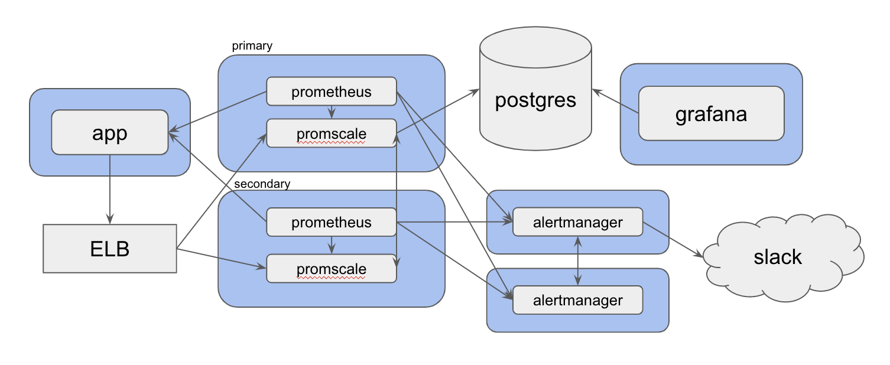

# Promscale Demo

this repo demonstrates how to standup a highly-available prometheus stack with durable storage via postgres.

## Usage

start the full stack:

```sh
./start.sh
```

cleanup any orphaned resources:

```sh
./stop.sh
```

enter psql shell:

```sh
./psql.sh
```

start pushing metrics to prometheus in a recurring interval:

```sh
node app/send-telemetry.js
```

## Architecture

